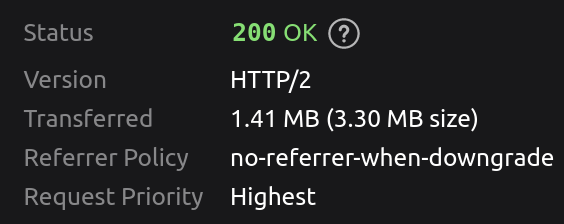

# EYE JS
Distributing the [EYE](https://github.com/eyereasoner/eye) reasoner for browser and node using WebAssembly.

[](https://github.com/eyereasoner/eye-js/blob/master/LICENSE)
[](https://www.npmjs.com/package/eyereasoner)
[](https://github.com/eyereasoner/eye-js/tree/main/)
[](https://dependabot.com/)
[](https://github.com/semantic-release/semantic-release)
[](https://www.npmjs.com/package/eyereasoner)

## Usage

The simplest way to use this package is to use the `n3reasoner` to execute a query over a dataset and get the results. The input `data` should include the data and any inference rules that you wish to apply to the dataset; the optional `query` should match the pattern of data you wish the engine to return; if left undefined, all new inferred facts will be returned. For example:

```ts
import { n3reasoner } from 'eyereasoner';

export const queryString = `
@prefix : <http://example.org/socrates#>.

{:Socrates a ?WHAT} => {:Socrates a ?WHAT}.
`;

export const dataString = `
@prefix rdfs: <http://www.w3.org/2000/01/rdf-schema#>.
@prefix : <http://example.org/socrates#>.

:Socrates a :Human.
:Human rdfs:subClassOf :Mortal.

{?A rdfs:subClassOf ?B. ?S a ?A} => {?S a ?B}.
`;

// The result of the query (as a string)
const resultString = await n3reasoner(dataString, queryString);

// All inferred data
const resultString = await n3reasoner(dataString);
```

The `n3reasoner` accepts both `string`s (formatted in Notation3 syntax) and `quad`s as input. The output will be of the same type as the input `data`. This means that we can use `n3reasoner` with RDF/JS quads as follows:

```ts
import { Parser } from 'n3';

const parser = new Parser({ format: 'text/n3' });
export const queryQuads = parser.parse(queryString);
export const dataQuads = parser.parse(dataString);

// The result of the query (as an array of quads)
const resultQuads = await n3reasoner(dataQuads, queryQuads);
```

### Options

The `n3reasoner` function allows one to optionally pass along a set of options

```ts
import { n3reasoner } from 'eyereasoner';

const data = `
@prefix : <urn:example.org:> .
:Alice a :Person .
{ ?S a :Person } => { ?S a :Human } .
`;

const result = await n3reasoner(data, undefined, {
  output: 'derivations',
  outputType: 'string'
});
```

The `options` parameter can be used to configure the reasoning process. The following options are available:
- `output`: What to output with implicit queries.
    - `derivations`: output only new derived triples, a.k.a `--pass-only-new` (default)
    - `deductive_closure`: output deductive closure, a.k.a `--pass`
    - `deductive_closure_plus_rules`: output deductive closure plus rules, a.k.a `--pass-all`
    - `grounded_deductive_closure_plus_rules`: ground the rules and output deductive closure plus rules, a.k.a `--pass-all-ground`
- `outputType`: The type of output (if different from the input)
    - `string`: output as string
    - `quads`: output as array of RDF/JS Quads

## Advanced usage

To have more granular control one can also use this module as follows

```ts
import { SwiplEye, queryOnce } from 'eyereasoner';

const query = `
@prefix : <http://example.org/socrates#>.

{:Socrates a ?WHAT} => {:Socrates a ?WHAT}.
`

const data = `
@prefix rdfs: <http://www.w3.org/2000/01/rdf-schema#>.
@prefix : <http://example.org/socrates#>.

:Socrates a :Human.
:Human rdfs:subClassOf :Mortal.

{?A rdfs:subClassOf ?B. ?S a ?A} => {?S a ?B}.
`

async function main() {
  // Instantiate a new SWIPL module and log any results it produces to the console
  const Module = await SwiplEye({ print: (str: string) => { console.log(str) }, arguments: ['-q'] });

  // Load the the strings data and query as files data.n3 and query.n3 into the module
  Module.FS.writeFile('data.n3', data);
  Module.FS.writeFile('query.n3', query);

  // Execute main(['--nope', '--quiet', './data.n3', '--query', './query.n3']).
  queryOnce(Module, 'main', ['--nope', '--quiet', './data.n3', '--query', './query.n3']);
}

main();
```

## Selecting the `SWIPL` module

The `SWIPL` module exported from this library is a build that inlines WebAssembly and data strings in order to be
isomorphic across browser and node without requiring any bundlers. Some users may wish to have more fine-grained control
over their SWIPL module; for instance in order to load the `.wasm` file separately for performance. In these cases
see the `SWIPL` modules exported by [npm swipl wasm](https://github.com/rla/npm-swipl-wasm/).

An example usage of the node-specific swipl-wasm build is as follows:
```ts
import { loadEyeImage, queryOnce } from 'eyereasoner';
import SWIPL from 'swipl-wasm/dist/swipl-node';

async function main() {
  const SwiplEye = loadEyeImage(SWIPL);

  // Instantiate a new SWIPL module and log any results it produces to the console
  const Module = await SwiplEye({ print: (str: string) => { console.log(str) }, arguments: ['-q'] });

  // Load the the strings data and query as files data.n3 and query.n3 into the module
  Module.FS.writeFile('data.n3', data);
  Module.FS.writeFile('query.n3', query);

  // Execute main(['--nope', '--quiet', './data.n3', '--query', './query.n3']).
  queryOnce(Module, 'main', ['--nope', '--quiet', './data.n3', '--query', './query.n3']);
}

main();
```

## CLI Usage

This package also exposes a CLI interface for using the reasoner. It can be used via `npx`

```bash
# Run the command using the latest version of eyereasoner on npm
npx eyereasoner --nope --quiet ./socrates.n3 --query ./socrates-query.n3
```

or by globally installing `eyereasoner`

```bash
# Gloablly install eyereasoner
npm i -g eyereasoner
# Run a command with eyereasoner
eyereasoner --nope --quiet ./socrates.n3 --query ./socrates-query.n3
```

## Browser Builds

For convenience we provide deploy bundled versions of the eyereasoner on github pages which can be directly used in an HTML document as shown in [this example](https://github.com/eyereasoner/eye-js/tree/main/examples/prebuilt/index.html) which is also [deployed on github pages](https://eyereasoner.github.io/eye-js/example/index.html).

There is a bundled version for each release - which can be found at the url:
<p align=center>
https://eyereasoner.github.io/eye-js/vMajor/vMinor/vPatch/index.js

for instance v2.3.14 has the url https://eyereasoner.github.io/eye-js/2/3/14/index.js. We also have shortcuts for:
 - the latest version https://eyereasoner.github.io/eye-js/latest/index.js,
 - the latest of each major version https://eyereasoner.github.io/eye-js/vMajor/latest/index.js, and
 - the latest of each minor version https://eyereasoner.github.io/eye-js/vMajor/vMinor/latest/index.js

Available versions can be browsed at https://github.com/eyereasoner/eye-js/tree/pages.

Github also serves these files with a `gzip` content encoding which compresses the script to ~1.4MB when being served.



### Dynamic imports

We also distribute bundles that can be dynamically imported on github pages; for example
```ts
const { eyereasoner } = await import('https://eyereasoner.github.io/eye-js/2/latest/dynamic-import.js');

// Instantiate a new SWIPL module and log any results it produces to the console
const Module = await eyereasoner.SwiplEye({ print: (str) => { console.log(str) }, arguments: ['-q'] });

// Load the the strings data and query as files data.n3 and query.n3 into the module
Module.FS.writeFile('data.n3', data);
Module.FS.writeFile('query.n3', query);

// Execute main(['--nope', '--quiet', './data.n3', '--query', './query.n3']).
eyereasoner.queryOnce(Module, 'main', ['--nope', '--quiet', './data.n3', '--query', './query.n3']);
```
## Examples

We provide some examples of using `eyereasoner`:
 - Using as an npm package and bundling using webpack ([`./examples/rollup`](https://github.com/eyereasoner/eye-js/tree/main/examples/rollup)).
 - Using a prebuilt version of `eyereasoner` ([`./examples/prebuilt`](https://github.com/eyereasoner/eye-js/tree/main/examples/prebuilt)) - this example is [deployed on github pages](https://eyereasoner.github.io/eye-js/example/index.html).

## Performance

We use [benchmark.js](https://benchmarkjs.com/) to collect the performance results of some basic operations. Those results are published [here](https://eyereasoner.github.io/eye-js/dev/bench/).

## License
©2022–present
[Jesse Wright](https://github.com/jeswr),
[Jos De Roo](https://github.com/josd/),
[MIT License](https://github.com/eyereasoner/eye-js/blob/master/LICENSE).
